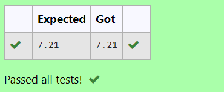

# DISTANCE-BETWEEN-TWO-POINTS

## AIM:
To write a python program to find the distance two 2 points
## ALGORITHM:
### Step 1: 
To write a python program to find the distance two 2 points


### Step 2: 
Mention the coordinates as given


### Step 3: 
Substitute the values in the distance formula  
### Step 4: 
Assign the values of coordinates in the formula


### Step 5: 
End the program


### PROGRAM:
```python
#Program to find the distance between two points.
#Developed by: S.S.SRIRAM
#RegisterNumber:22004880
import math as m
l1=[4,2]
l2=[10,6]
d=m.sqrt((l2[0]-l1[0])**2+(l2[1]-l1[1])**2)
print("{:.2f}".format(d))
```
  


### OUTPUT:



### RESULT:
Thus findings of distance between two points are successfully executed

